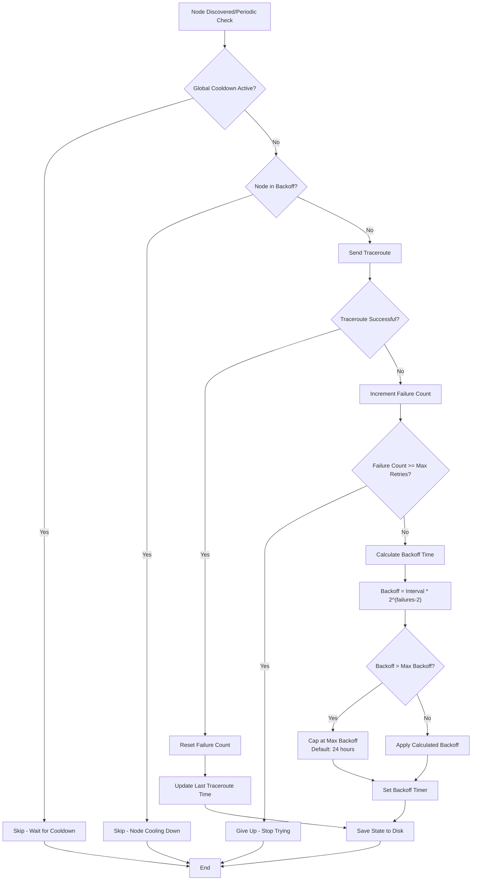

# nhmesh-telemetry

## Docker Images

This project provides two Docker images:

### nhmesh/telemetry-producer

A Docker container that connects to a Meshtastic node and publishes packets to an MQTT broker.

#### Usage

```bash
docker run -d \
  --name telemetry-producer \
  -e NODE_IP=192.168.1.50 \
  -e MQTT_ENDPOINT=mqtt.nhmesh.live \
  -e MQTT_USERNAME=your_username \
  -e MQTT_PASSWORD=your_password \
  ghcr.io/nhmesh/telemetry-producer:latest
```

#### Environment Variables

| Variable                       | Default                         | Description                                                    |
| ------------------------------ | ------------------------------- | -------------------------------------------------------------- |
| `LOG_LEVEL`                    | `INFO`                          | Logging level (DEBUG, INFO, WARNING, ERROR)                   |
| `MQTT_ENDPOINT`                | `mqtt.nhmesh.live`              | MQTT broker address                                            |
| `MQTT_PORT`                    | `1883`                          | MQTT broker port                                               |
| `MQTT_USERNAME`                | -                               | MQTT username for authentication                               |
| `MQTT_PASSWORD`                | -                               | MQTT password for authentication                               |
| `NODE_IP`                      | -                               | IP address of the Meshtastic node to connect to               |
| `MQTT_TOPIC`                   | `msh/US/NH/`                    | Root MQTT topic for publishing messages                       |
| `TRACEROUTE_INTERVAL`          | `10800`                         | Interval between periodic traceroutes in seconds (3 hours)    |
| `TRACEROUTE_MAX_RETRIES`       | `5`                             | Maximum number of retry attempts for failed traceroutes       |
| `TRACEROUTE_MAX_BACKOFF`       | `86400`                         | Maximum backoff time in seconds for failed nodes (24 hours)   |
| `TRACEROUTE_PERSISTENCE_FILE`  | `/tmp/traceroute_state.json`    | Path to file for persisting retry/backoff state across restarts |

#### Description

The Producer container connects to a Meshtastic node via its HTTP API and forwards packets from the mesh network to an MQTT broker. This allows for remote monitoring and processing of Meshtastic network traffic.

The producer includes intelligent traceroute functionality that:
- Automatically performs traceroutes to newly discovered nodes
- Periodically re-traceroutes known nodes at configurable intervals
- Implements exponential backoff for nodes that consistently fail traceroutes
- Uses configurable retry limits and maximum backoff times to prevent resource waste
- Persists retry counts and backoff states to filesystem to survive container restarts

The producer requires:
1. A running Meshtastic node with HTTP API enabled
2. An MQTT broker that it can connect to with the provided credentials

##### Traceroute Logic and Backoff Strategy

The telemetry producer implements an intelligent traceroute system that automatically discovers network topology while being respectful of network resources through exponential backoff and retry limiting.

The traceroute functionality serves two main purposes:
1. **Network Discovery**: Automatically traceroute newly discovered nodes to map network topology
2. **Topology Monitoring**: Periodically re-traceroute known nodes to detect topology changes

###### Key Features

- **Automatic Discovery**: New nodes are automatically queued for traceroute
- **Periodic Re-scanning**: Known nodes are re-tracerouted at configurable intervals (default: 3 hours)
- **Exponential Backoff**: Failed traceroutes trigger increasingly longer delays before retry
- **Retry Limiting**: Nodes that consistently fail are eventually abandoned
- **Persistent State**: Retry counts and backoff timers survive container restarts
- **Global Cooldown**: Prevents overwhelming the network with too many simultaneous traceroutes

###### Backoff Strategy

The system uses exponential backoff with the following logic:



###### Backoff Calculation Examples

With default settings (3-hour interval, 5 max retries, 24-hour max backoff):

| Failure Count | Backoff Time | Description |
|---------------|--------------|-------------|
| 1 | 0 seconds | First failure - immediate retry allowed |
| 2 | 3 hours | Base interval |
| 3 | 6 hours | 2× base interval |
| 4 | 12 hours | 4× base interval |
| 5+ | 24 hours | Capped at maximum |

###### State Persistence

The system maintains persistent state across restarts by saving:
- Last traceroute time for each node
- Failure counts for each node  
- Backoff timers for failed nodes
- Automatic cleanup of expired backoff states on startup

This ensures that container restarts don't reset the backoff logic, preventing immediate re-flooding of the network with traceroutes to previously failing nodes

### nhmesh/telemetry-collector

A Docker container that subscribes to MQTT topics with Meshtastic data and stores it into Elasticsearch.

#### Usage

```bash
docker run -d \
  --name telemetry-collector \
  -e MQTT_ENDPOINT=mqtt.nhmesh.live \
  -e MQTT_USERNAME=your_username \
  -e MQTT_PASSWORD=your_password \
  -e ES_ENDPOINT=your_elasticsearch_endpoint \
  -e ES_USERNAME=telemetry_writer \
  -e ES_PASSWORD=your_es_password \
  ghcr.io/nhmesh/telemetry-collector:latest
```

##### Environment Variables

| Variable                             | Default            | Description                                                 |
| ------------------------------------ | ------------------ | ----------------------------------------------------------- |
| `LOG_LEVEL`                          | `INFO`             | Logging level (DEBUG, INFO, WARNING, ERROR)                 |
| `MQTT_ENDPOINT`                      | `mqtt.nhmesh.live` | MQTT broker address                                         |
| `MQTT_PORT`                          | `1883`             | MQTT broker port                                            |
| `MQTT_USERNAME`                      | -                  | MQTT username for authentication                            |
| `MQTT_PASSWORD`                      | -                  | MQTT password for authentication                            |
| `MQTT_SUB_TOPIC`                     | `msh/US/#`         | MQTT topic pattern to subscribe to                          |
| `ES_ENDPOINT`                        | `large4cats`       | Elasticsearch endpoint URL                                  |
| `ES_USERNAME`                        | -                  | Elasticsearch username (typically `TELEMETRY_ES_USERNAME`)  |
| `ES_PASSWORD`                        | -                  | Elasticsearch password (typically `TELEMETRY_ES_PASSWORD`)  |
| `PACKET_PROCESSING_DELAY_SECONDS`    | `5.0`              | Seconds to delay packet processing to prioritize RF packets |
| `PACKET_PROCESSING_INTERVAL_SECONDS` | `0.5`              | Seconds interval for checking pending packets               |

#### Description

The Collector container subscribes to MQTT topics that contain Meshtastic packet data, processes these packets, and stores them into Elasticsearch for further analysis and visualization.

The collector requires:
1. An MQTT broker with Meshtastic data (usually published by the producer container)
2. An Elasticsearch instance for storing the processed data

## Development

 - Install Python
 - Install Poetry

```
poetry install

poetry run nhmesh-telemetry/producer.py
poetry run nhmesh-telemetry/collector.py
```

## Docker Setup

 1. In the docker folder... copy the sample.env to telemetry.env and tweak values
 2. `docker compose up -d`

 ```
 docker compose logs
 ```

Kibana dashboard - https://localhost:5601
